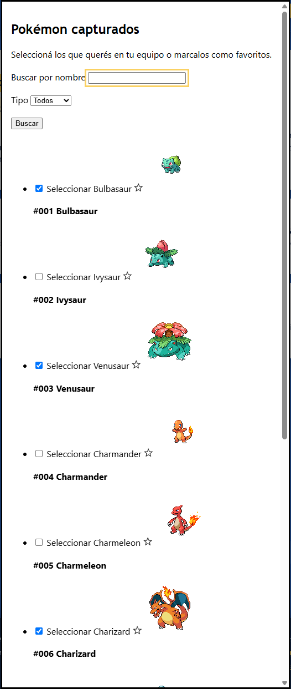
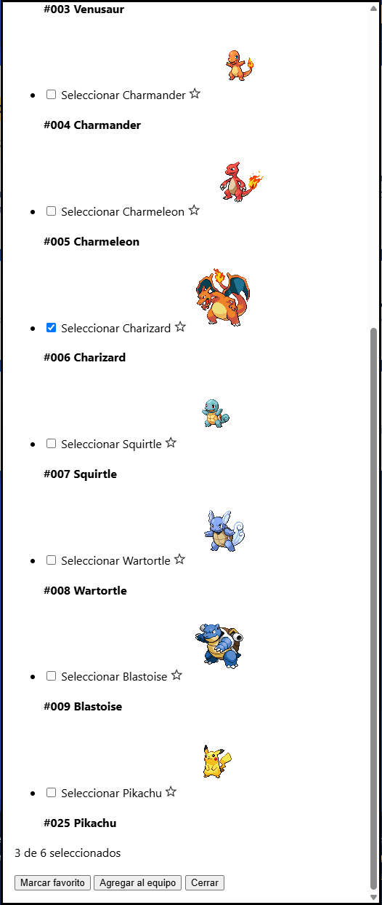
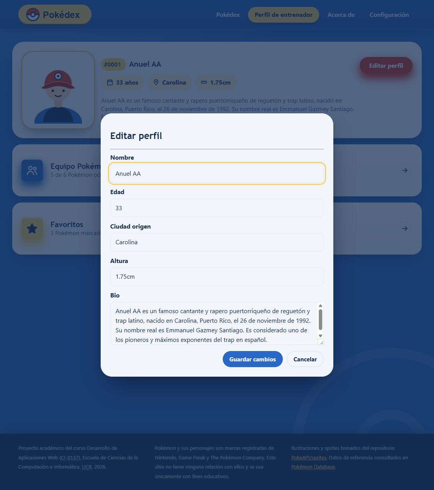
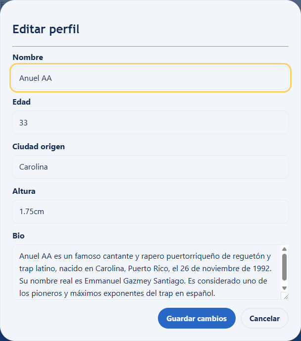

# Pokédex — CI-0137

## Integrantes

- Jason Montenegro C4H386
- Raul Gadea C12989
- Juan Gonzalez C4F588

## Puntos Extra

### Extras del Laboratorio #1

Estos extras corresponden a la entrega anterior. Se añadieron evidencias para complementar lo implementado en este laboratorio: la página del perfil y los diálogos requeridos de equipo Pokémon, favoritos y estadísticas; Para mantener uniformidad en el README. Esta ventana fue maquetada desde la entrega anterior pero para este laboratorio se agrego la parte estetica uniforme con estilos CSS del modal.

1. **Diálogo de Pokémon capturados (wireframe 07)** Incluye búsqueda por nombre y filtro por tipo con etiquetas, los 10 Pokémon, sus casillas de selección e indicadores de favorito, además de las acciones del diálogo. Se encuentra en `perfil-entrenador.html`, dentro de `#modal-capturados`.
   - Búsqueda, filtro y primeras entradas:

     

   - Resto de la lista y acciones:

     

2. **Formulario para editar el perfil de entrenador.** El botón «Editar perfil» abre un diálogo con campos etiquetados para nombre, edad, ciudad, altura y biografía, y controles «Guardar cambios» y «Cancelar». Está en `perfil-entrenador.html` (`#edit-profile-modal`) y sus estilos en `perfil-entrenador.css`. Los controles cierran el diálogo; la maqueta no persiste los cambios en la ficha.
   - Diálogo abierto desde el perfil:

     

   - Campos editables y botones:

     

### Extras del Laboratorio #2

Después de completar los requisitos obligatorios aplicables al modal, se añadieron los dos extras opcionales del enunciado:

1. **Tipografía de Google Fonts:** Baloo 2 para el título y los nombres de Pokémon; Nunito para el texto. Las fuentes se enlazan desde Google Fonts en `modal_team_pokemon.html` y `perfil-entrenador.html`. Las variables `--fuente-titulo` y `--fuente-texto` se redefinen dentro de `.team-modal` en `modal-team-pokemon.css`, por lo que el resto del perfil conserva sus tipografías.
   - Vista independiente:

     

   - Modal abierto desde el perfil:

     
2. **Animación propia del botón:** «Agregar desde capturados» combina elevación, escala y giro en `:hover` y `:focus-visible`. La transición afecta explícitamente a `transform` y dura `0.2s`, en `modal-team-pokemon.css`.
   - Estado hover:

     

   - Estado de foco por teclado:

     

Link:
https://jason-montenegro.github.io/pokedex-C4H386-C12989-C4F588/
