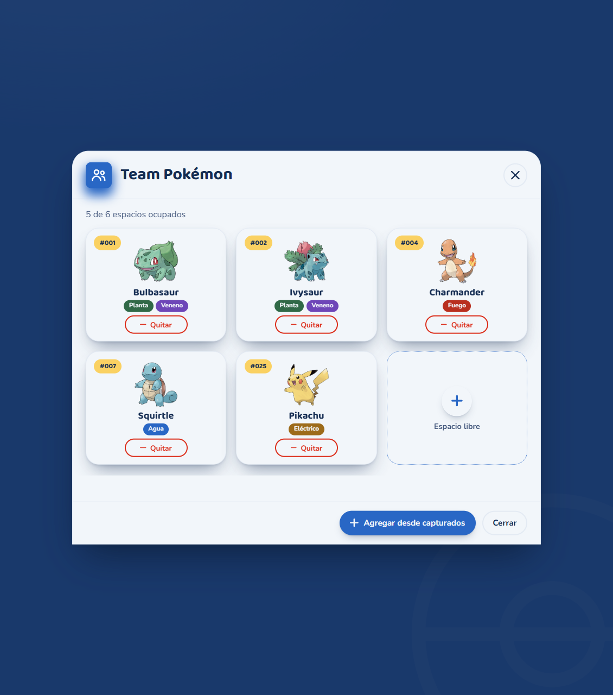
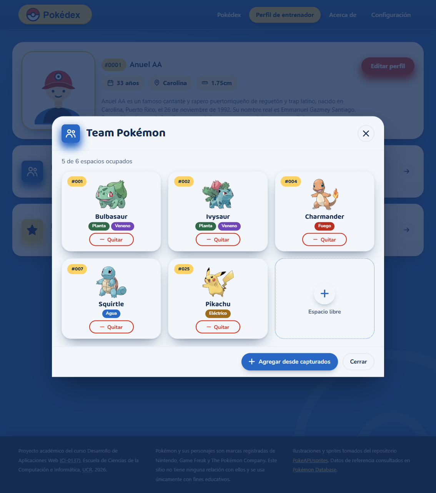
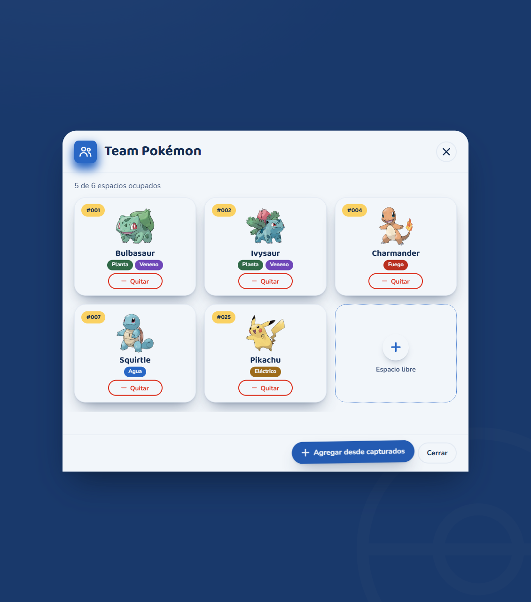
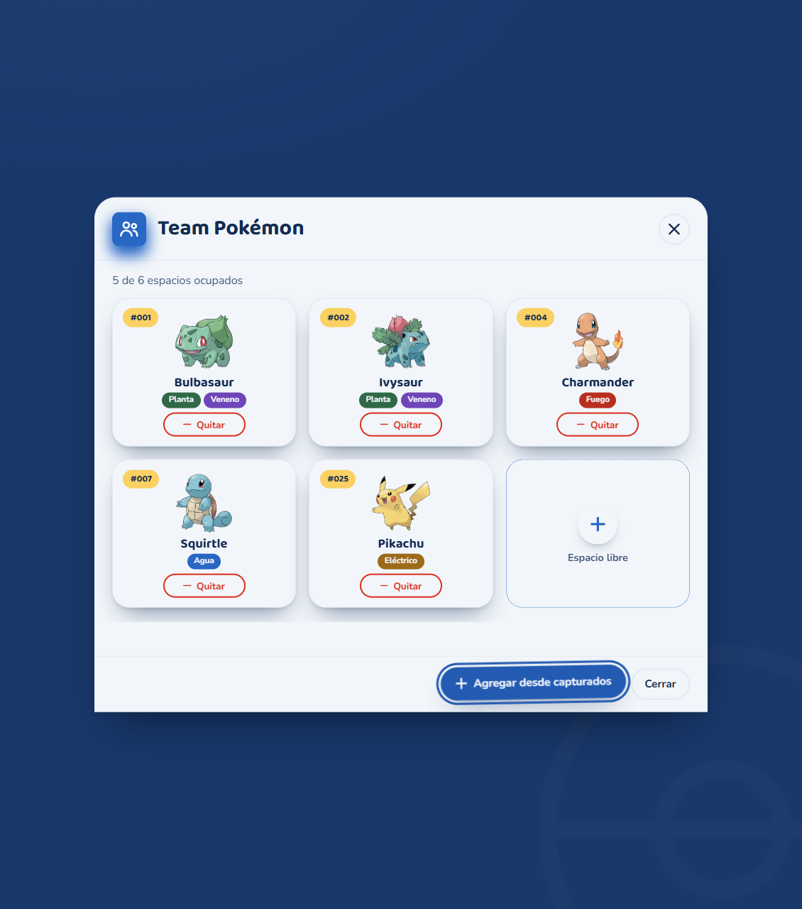

# Pokédex — CI-0137

## Integrantes

- Jason Montenegro C4H386
- Raul Gadea C12989
- Juan Gonzalez C4F588

## Puntos Extra

### Extras del modal de Equipo Pokémon

Después de completar los requisitos obligatorios aplicables al modal, se añadieron los dos extras opcionales del enunciado:

1. **Tipografía de Google Fonts:** Baloo 2 para el título y los nombres de Pokémon; Nunito para el texto. Las fuentes se enlazan desde Google Fonts en `modal_team_pokemon.html` y `perfil-entrenador.html`. Las variables `--fuente-titulo` y `--fuente-texto` se redefinen dentro de `.team-modal` en `modal-team-pokemon.css`, por lo que el resto del perfil conserva sus tipografías.
   - Vista independiente:

     

   - Modal abierto desde el perfil:

     
2. **Animación propia del botón:** «Agregar desde capturados» combina elevación, escala y giro en `:hover` y `:focus-visible`. La transición afecta explícitamente a `transform` y dura `0.2s`, en `modal-team-pokemon.css`.
   - Estado hover:

     

   - Estado de foco por teclado:

     

### Otros casos de puntos extra del proyecto

- [ ] Diálogo de Pokémon capturados (wireframe 07).
- [ ] Formulario para editar el entrenador (Sin wireframe designado).

Link:
https://jason-montenegro.github.io/pokedex-C4H386-C12989-C4F588/
